[//]: # (This template replaces README.md when someone creates a new repo with the fastpages template.)

 
 
[![](https://img.shields.io/static/v1?label=fastai&message=fastpages&color=57aeac&labelColor=black&style=flat&logo=data:image/png;base64,iVBORw0KGgoAAAANSUhEUgAAABkAAAAjCAYAAABhCKGoAAAGMklEQVR42q1Xa0xTVxyfKExlui9blszoB12yDzPGzJhtyT5s+zBxUxELBQSHm2ZzU5epBF/LclXae29pCxR5VEGgLQUuIOKDuClhm8oUK7S9ve19tLTl/fA5p9MNc/Y/hRYEzGLxJL/87zk9Ob/zf5++NGHMALzYgdDYmWh0Qly3Lybtwi6lXdpN2cWN5A0+hrQKe5R2PoN2uD+OKcn/UF5ZsVduMmyXVRi+jzebdmI5/juhwrgj3mTI2GA0vvsUIcMwM7GkOD42t7Mf6bqHkFry2yk7X5PXcxMVDN5DGtFf9NkJfe6W5iaUyFShjfV1KPlk7VPAa0k11WjzL+eRvMJ4IKQO0dw8SydJL+Op0u5cn+3tQTn+fqTivTbQpiavF0iG7iGt6NevKjpKpTbUo3hj+QO47XB8hfHfIGAelA+T6mqQzFi+e0oTKm3iexQnXaU56ZrK5SlVsq70LMF7TuX0XNTyvi1rThzLST3TgOCgxwD0DPwDGoE07QkcSl/m5ynbHWmZVm6b0sp9o2DZN8aTZtqk9w9b2G2HLbbvsjlx+fry0vwU0OS5SH68Ylmilny3c3x9SOvpRuQN7hO8vqulZQ6WJMuXFAzcRfkDd5BG8B1bpc+nU0+fQtgkYLIngOEJwGt/J9UxCIJg1whJ05Ul4IMejbsLqUUfOjJKQnCDr4ySHMeO1/UMIa3UmR9TUpj7ZdMFJK8yo6RaZjLAF/JqM/rifCO+yP4AycGmlgUaT9cZ0OYP2um5prjBLhtvLhy68Fs7RFqbRvSlf15ybGdyLcPJmcpfIcIuT4nqqt+Sa2vaZaby1FB+JGi1c9INhuiv9fpIysItIh3CVgVAzXfEE1evzse/bwr8bolcAXs+zcqKXksQc5+FD2D/svT06I8IYtaUeZLZzsVm+3oRDmON1Ok/2NKyIJSs0xnj84RknXG6zgGEE1It+rsPtrYuDOxBKAJLrO1qnW7+OpqeNxF4HWv6v4Rql3uFRvL/DATnc/29x4lmy2t4fXVjY+ASGwylm8DBvkSm2gpgx1Bpg4hyyysqVoUuFRw0z8+jXe40yiFsp1lpC9navlJpE9JIh7RVwfJywmKZO4Hkh02NZ1FilfkJLi1B4GhLPduAZGazHO9LGDX/WAj7+npzwUQqvuOBoo1Va91dj3Tdgyinc0Dae+HyIrxvc2npbCxlxrJvcW3CeSKDMhKCoexRYnUlSqg0xU0iIS5dXwzm6c/x9iKKEx8q2lkV5RARJCcm9We2sgsZhGZmgMYjJOU7UhpOIqhRwwlmEwrBZHgCBRKkKX4ySVvbmzQnXoSDHWCyS6SV20Ha+VaSFTiSE8/ttVheDe4NarLxVB1kdE0fYAgjGaOWGYD1vxKrqmInkSBchRkmiuC4KILhonAo4+9gWVHYnElQMEsAxbRDSHtp7dq5CRWly2VlZe/EFRcvDcBQvBTPZeXly1JMpvlThzBBRASBoDsSBIpgOBQV6C+sUJzffwflQX8BTevCTZMZeoslUo9QJJZYTZDw3RuIKtIhlhXdfhDoJ7TTXY/XdBBpgUshwFMSRYTVwim7FJvt6aFyOnoVKqc7MZQDzzNwsmnd3UegCudl8R2qzHZ7bJbQoYGyn692+zMULCfXenoOacTOTBUnJYRFsq+5+a3sjp5BXM6hEz7ObHNoVEIHyocekiX6WIiykwWDd1HhzT8RzY2YqxnK0HNQBJtW500ddiwrDgdIeCABZ4MPnKQdk9xDhUP3wfHSqbBI9v/e9jo0Iy30cCOgAMyVgMMVCMwql/cQxfKp2R1dWWrRm0PzUkrIXC9ykDY+hnJ5DqkE709guriwSRgGzWTQCPABWJZ6vbNHQlgo099+CCEMPnF6xnwynYETEWd8ls0WPUpSWnTrfuAhAWacPslUiQRNLBGXFSA7TrL8V3gNhesTnLFY0jb+bYWVp0i7SClY184jVtcayi7so2yuA0r4npbjsV8CJHZhPQ7no323cJ5w8FqpLwR/YJNRnHs0hNGs6ZFw/Lpsb+9oj/dZSbuL0XUNojx4d9Gch5mOT0ImINsdKyHzT9Muz1lcXhRWbo9a8J3B72H8Lg6+bKb1hyWMPeERBXMGRxEBCM7Ddfh/1jDuWhb5+QkAAAAASUVORK5CYII=)](https://github.com/fastai/fastpages)

https://AXI-Technologies.github.io/AXI-Fastpages/

# My Blog

_powered by [fastpages](https://github.com/fastai/fastpages)_

## What To Do Next?

Great!  You have setup your repo.  Now its time to start writing content.  Some helpful links:

- [Writing Blogs With Jupyter](https://github.com/fastai/fastpages#writing-blog-posts-with-jupyter)

- [Writing Blogs With Markdown](https://github.com/fastai/fastpages#writing-blog-posts-with-markdown)

- [Writing Blog Posts With Word](https://github.com/fastai/fastpages#writing-blog-posts-with-microsoft-word)

- [(Optional) Preview Your Blog Locally](_fastpages_docs/DEVELOPMENT.md)

Note: you may want to remove example blog posts from the `_posts`,  `_notebooks` or `_word` folders (but leave them empty, don't delete these folders) if you don't want these blog posts to appear on your site.

Please use the [nbdev & blogging channel](https://forums.fast.ai/c/fastai-users/nbdev/48) in the fastai forums for any questions or feature requests.

## GUIDE - Step by step:

1. **Login to GitHub:** If you don't have a GitHub account, register for one, then login to it.

2. **Click this link:** [https://github.com/fastai/fastpages/generate](https://github.com/fastai/fastpages/generate)

3. **Wait a minute or so.** Then reload your repository page. This will review a new automatically created pull request. You can see it here: 
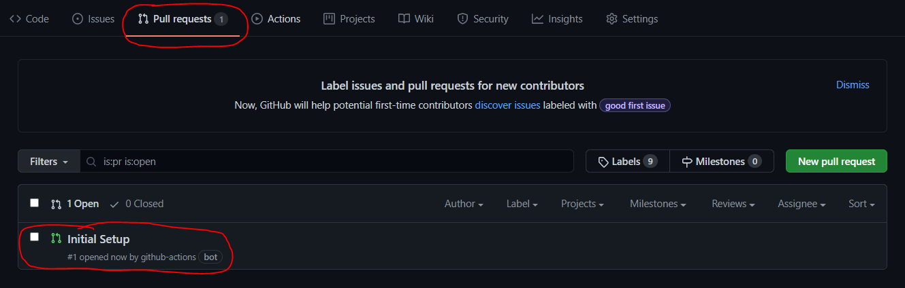

4. **Choice Intitial Setup.** This will show you some instructions.

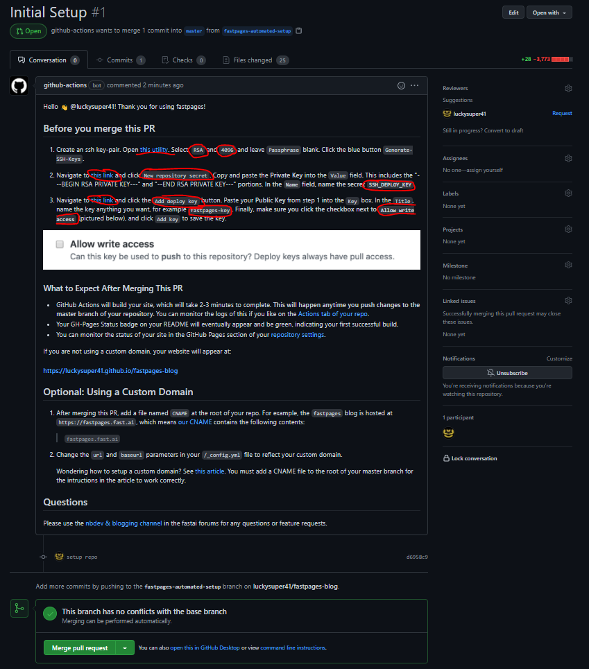

5. **Follow instructions** and MERGE PULL REQUEST.

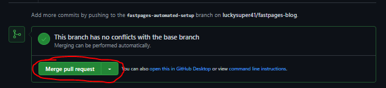

6. **Wait for a few minutes.** GitHub Pages will automatically create your website, but it takes some time. This will happen every time you push new content to the master branch of your repository (more on that below). 

7. **Check status.** If u see your README is like this image -> It’s oke now and we can click this link below for accessing your blog.

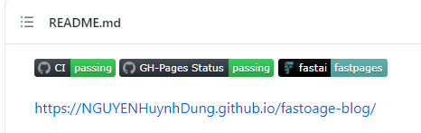

8. **Create blog with fastpages.**

Blog a été sauvegardé comme ce nom.

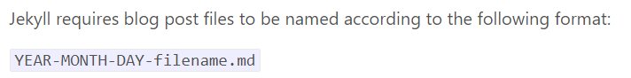

On peut créer un blog par 3 types: 

- Jupyter Notebook (.ipynb) sauvegarder dans **_notebooks.**
Link: [https://fastpages.fast.ai/jupyter/2020/02/20/test.html](https://fastpages.fast.ai/jupyter/2020/02/20/test.html)

- Markdown (.md) sauvegarder dans **_post.**
Link: [https://fastpages.fast.ai/markdown/2020/01/14/test-markdown-post.html](https://fastpages.fast.ai/markdown/2020/01/14/test-markdown-post.html)

- Microsoft Word (.docx) sauvegarder dans **_word.**
Link: [https://fastpages.fast.ai/2020/01/01/Microsoft-Word-Example-Post.html](https://fastpages.fast.ai/2020/01/01/Microsoft-Word-Example-Post.html)

9. **Syntax ‘Kramdown’**
What's important to remember is that GitHub pages uses a type of Markdown called 'Kramdown'. There is a guide to using Kramdown here: [https://kramdown.gettalong.org/quickref.html](https://kramdown.gettalong.org/quickref.html)

10. **The Page Generation Process.**
We need to talk a bit about what happens when your website pages are generated from your repository. Recall this diagram from the previous post of this series:

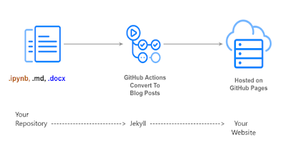

Here it is again, with a bit of elaboration. Your repository is on the left. It feeds through a program called [Jekyll](https://jekyllrb.com/) running in GitHub Actions, and the output if your website on the right. All of this happens automatically (but it takes a few minutes, which is why you have to wait).
If you look at the [GitHub Actions webpage](https://github.com/marketplace?type=actions) you can see that there are many choice. What Fastpages does for us is to select and configure GitHub Actions in Jekyll.
This gives us more options in our Markdown pages. We can use the 'comments and processing instructions' section of the page to give Jekyll some instructions when it processes our page.

11. **Some note for le type in the section titled 'Front-Matter related options'.**

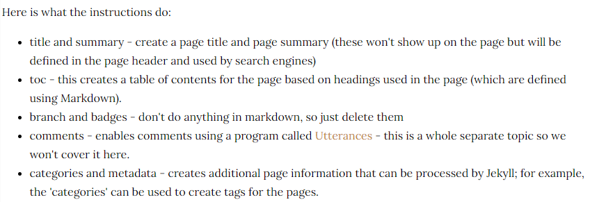

12. **Main page.**

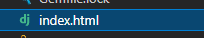

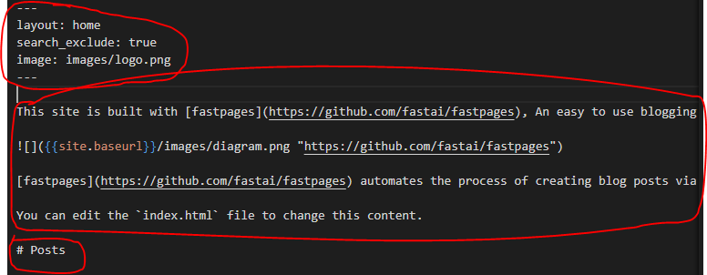

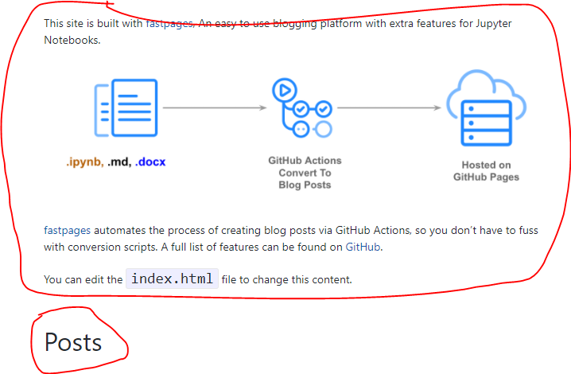

13. **Others pages.**

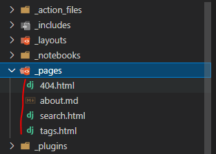

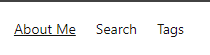

14. **Name lien le domaine du site-web.**

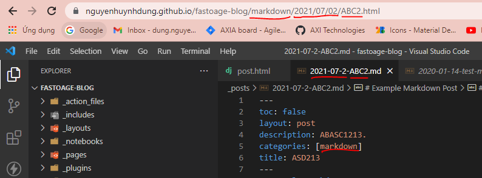

15. **Add custome layout default**

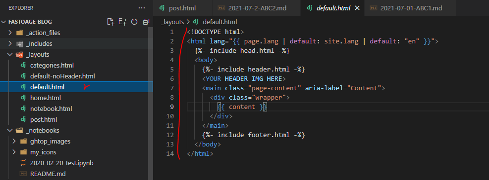

16. **Others sources**

[https://fastpages.fast.ai/](https://fastpages.fast.ai/)
